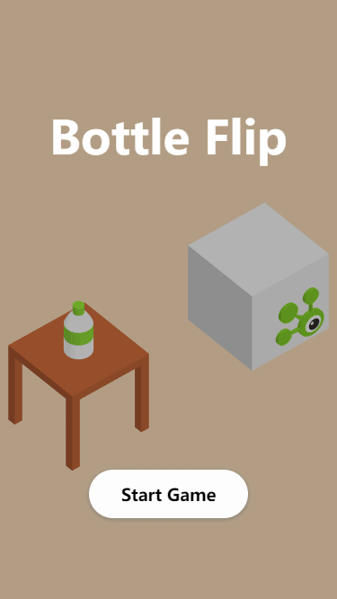

## Start

```bash
git clone https://github.com/wuzekang/bottle-flip.git
cd bottle-flip
npm install
npm start
```

## Screenshots

| Start       | Game       | Over       |
|-------------|------------|------------|
| ![Start][1] | ![Game][2] | ![Over][3] |


[1]: ./screenshots/1.start.png
[2]: ./screenshots/2.game.png
[3]: ./screenshots/3.over.png